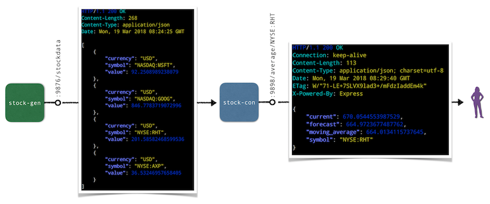

# Developing on Kubernetes—stock market simulator

This repository contains two microservices that make up a stock market simulator application:

One microservice, the so called [stock generator](stock-gen/) is written in Go and serves randomized stock data randomly via the HTTP endpoint `stockdata/`.

A second microservice, the so called [stock consumer](stock-con/) is written in Node.js and consumes the stock data generated by the Go microservice. It serves the following HTTP endpoints: 

1. `average/$SYMBOL` … calculates basic stats of stock symbol `$SYMBOL`
1. `gekko/$SYMBOL` … provides a recommendation like sell/hold/buy for stock symbol `$SYMBOL` (not yet implemented)
